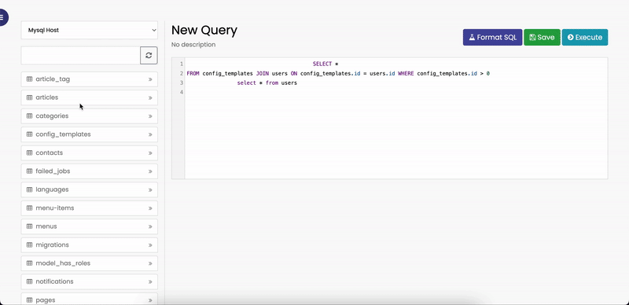

# Laravel Query Execute

<p align="center">
  
</p>

### Description
A simple package that helps you interact directly with the database, inspired by redash. When running commands that affect the database structure, you can rollback if necessary.

### Installation

Install the package:
```
composer require truongbo/laravel-query-execute
```

Run test:
```php
./vendor/bin/phpunit
```

Publish package files (config & asset):
```php
php artisan vendor:publish --provider="Bo\LaravelQueryExecute\LaravelQueryExecuteServiceProvider"
```
